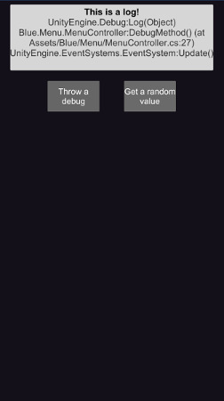

# Unity Menu

A simple unity menu to test functions



## Instructions

To use this menu first drag the prefab **Menu** to the scene(which is inside the folder *Blue/Menu*).

If you wish to use the mail capability, change the *Default Mail Directory* in the Menu inspector.

Then, in any script, call the following method:
```csharp
Blue.Menu.MenuController.AddButton(Action, string);
```

Action is a void method with no parameters, and string is the description of the button.

Be aware that the console has a screen that will show the last logged message.

An example of how to use this would be the following:
```csharp
private void MyMethod(){
	int i = Random.Range(0, 44);
	Debug.Log("The value is: " + i);
}

private void Start(){
	Blue.Menu.MenuController.AddButoon(MyMethod, "Get random value");
}
```

You can share your log through email pressing the message log screen.
